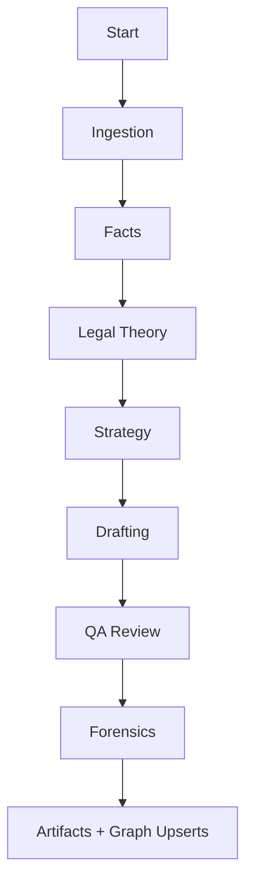

# Swarms Session Graph Integration

> Note: Filename is legacy for continuity; content is Swarms-first.

This document describes the Swarms session flow used by the Co-Counsel workflow pipeline. Each Swarm phase is mapped to a phase handler, with shared memory artifacts persisted after every phase. The knowledge graph is updated per phase and a refinement worker continues to enrich relationships asynchronously.

## Session Flow

## Persistence
- Workflow artifacts stored as JSON + Markdown.
- Graph upserts executed per phase.
- LlamaIndex nodes synced after ingestion and parsing.

## Manual Re-trigger
Each phase can be re-run independently via `/workflow/run` with explicit phase list.
